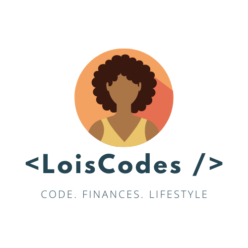

- I’m currently learning [C#](https://github.com/topics/csharp) and improving my JS skills
- I’m looking to collaborate with other content creators
- I love Anime: Moribito, Mushishi, FMA

Welcome to my github page! I have been programming for almost 4 years. My former life was in 3D, where I created interactive experiences and 3D renderings of recreational I mostly work in [JavaScript](https://github.com/topics/javascript) (React, Angular, JQuery) but have been learning [C#](https://github.com/topics/csharp).

### Ask Me About... Anything
I am here to help. If you have any questions, concerns, or opinions on any videos or posts I have made, please reach out. I want to improve and help you improve too.

### Pronouns
__she/her__

 

    
  

  ### Youtube Videos
<!-- YOUTUBE:START -->
- [Tips For Dealing With Impostor Syndrome As A Developer](https://www.youtube.com/watch?v=q2zFkMEL_cM)
- [Tips On Giving Your First Talk From Reviewing My First Talk](https://www.youtube.com/watch?v=fPmzXMyS0fw)
- [5 Tips For Junior Developers Starting Their Career](https://www.youtube.com/watch?v=bkn66AkXy9s)
- [My Career Change Into Programming](https://www.youtube.com/watch?v=5sIBRab9HBs)
- [3 Great Things To Know About Credit And Credit Repair](https://www.youtube.com/watch?v=lL9Ir4XuEvM)
<!-- YOUTUBE:END -->

  ### Blog Posts
<!-- BLOG-LIST:START -->
- [Creating A Mac Form Application
With C# and XCode As A Beginner](https://dev.to/loiscodes/creating-a-mac-form-application-with-c-and-xcode-as-a-beginner-51ao)
<!-- BLOG-LIST:END -->

### Github stats

 

